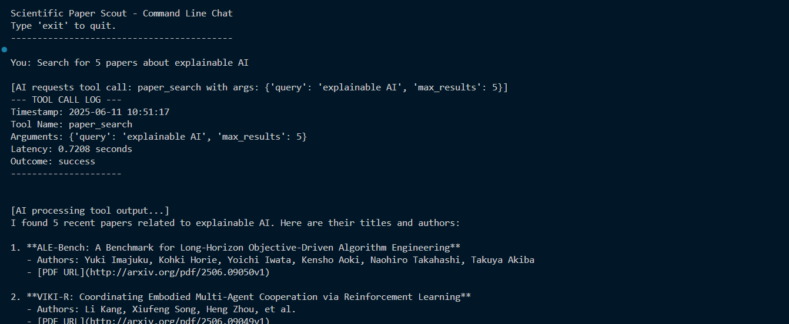
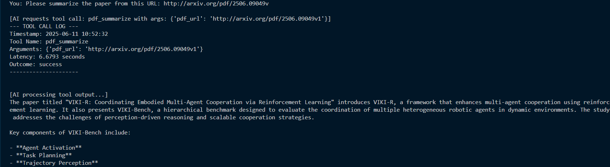

# 🔬 Scientific Paper Scout

An AI-powered command-line agent that helps users discover and summarize recent research papers from arXiv.


---


## Features: 

* **Paper Search:** Query the public arXiv API to find recent research papers on any topic.
* **PDF Summarization:** Download PDFs of research papers, extract their text, and generate concise summaries using a configurable Large Language Model (LLM) provider.
* **Conversational Interface:** Interact with the AI agent through a simple command-line chat.
* **Model Agnostic:** The core agent logic is designed to work with different LLM providers (e.g., OpenAI, Anthropic, Google Gemini) by simply changing configuration, not code.
* **Local Execution:** All components run locally on your machine with Python 3.x. Docker is **NOT** required.
* **Tool Call Logging:** Logs every tool call (name, arguments, timestamps, outcome) to the console for transparency and debugging.

## Getting Started:

Follow these steps to set up and run the Scientific Paper Scout on your local machine.

### Prerequisites

* Python 3.8+ installed on your system.
* A stable internet connection (for API calls to arXiv and your chosen LLM provider).
* An API key for your chosen LLM provider (e.g., OpenAI API Key).

### 1. Clone the Repository

First, clone this repository to your local machine:

```bash
git clone [https://github.com/GitGautamHub/scientific-paper-scout.git](https://github.com/your-username/scientific-paper-scout.git)
cd scientific-paper-scout
```
### 2. Set up Virtual Environment
It's highly recommended to use a virtual environment to manage project dependencies.

For Windows (PowerShell):
```bash
python -m venv venv
.\venv\Scripts\activate
```

For macOS/Linux:
```bash
python -m venv venv
source venv/bin/activate
```

### 3. Install Dependencies
Once your virtual environment is active, install the required Python packages:

```bash
pip install -r requirements.txt
```

### 4. Configuration
Create a file named .env in the root directory of your project (the same directory as main.py) and fill it with your API keys and LLM provider settings.

.env example:
```bash
# LLM API Keys (Uncomment and fill the one you intend to use)
OPENAI_API_KEY="sk-..." # Your OpenAI API Key here
# ANTHROPIC_API_KEY="sk-..." # Your Anthropic API Key here (if using Anthropic)
# GOOGLE_API_KEY="your_google_api_key_here" # Your Google Gemini API Key here (if using Google)

# LLM Provider Configuration
LLM_PROVIDER=openai # Set to 'openai', 'anthropic', or 'google' (must be lowercase)
LLM_MODEL=gpt-4o    # Example models: gpt-4o, claude-3-opus-20240229, gemini-pro (choose based on your LLM_PROVIDER)

# MCP Server URLs (default values are usually fine for local development)
PAPER_SEARCH_SERVER_URL="[http://127.0.0.1:8001](http://127.0.0.1:8001)"
PDF_SUMMARIZE_SERVER_URL="[http://127.0.0.1:8002](http://127.0.0.1:8002)"
```

Important Notes for .env:

- Replace placeholder API keys with your actual keys.
- Ensure LLM_PROVIDER matches the API key you've provided (e.g., if you use OPENAI_API_KEY, set LLM_PROVIDER=openai).
- Do NOT include comments on the same line as variable assignments (e.g., LLM_PROVIDER=openai # This is a comment will cause issues). Put comments on separate lines.

## Running the Application
The Scientific Paper Scout consists of three main components that need to run concurrently. You will need three separate terminal windows for this.

Terminal 1: Start the paper_search MCP Server
```bash
# First, activate your virtual environment
# For Windows (PowerShell):
.\venv\Scripts\activate
# For macOS/Linux:
# source venv/bin/activate

# Then run the server
uvicorn tools.paper_search_server:app --port 8001 --reload
```

Terminal 2: Start the pdf_summarize MCP Server

```
# First, activate your virtual environment
# For Windows (PowerShell):
.\venv\Scripts\activate
# For macOS/Linux:
# source venv/bin/activate

# Then run the server
uvicorn tools.pdf_summarize_server:app --port 8002 --reload
```
Terminal 3: Start the Main CLI Agent

```
# First, activate your virtual environment
# For Windows (PowerShell):
.\venv\Scripts\activate
# For macOS/Linux:
# source venv/bin/activate

# Then run the agent
python main.py
```

##  Usage
Once all three components are running successfully, you can interact with the Scientific Paper Scout in your third terminal where you ran python main.py.

Example Commands to try:

- Greeting:
```
You: Hello
```
- Search for Papers:
```
You: find 3 recent research papers on large language models
```
- Summarize a Paper:
```
You: Please summarize the paper from this URL: [http://arxiv.org/pdf/2506.09049v1.pdf](http://arxiv.org/pdf/2506.09049v1.pdf)
```

- General Knowledge Question (no tool call):
```
You: What is the capital of India?
```
- Exit the chat:
```
You: exit
```

## Project Structure:
```
scientific-paper-scout/
├── .env                    # Environment variables (API keys, URLs, etc.)
├── config.py               # Global configurations loaded from .env
├── main.py                 # The main CLI agent and LLM interaction logic
├── llm_client.py           # LLM abstraction layer for model-agnostic communication
├── tools/
│   ├── __init__.py
│   ├── paper_search_server.py  # FastAPI server for arXiv paper search
│   └── pdf_summarize_server.py # FastAPI server for PDF download and summarization
├── utils/
│   ├── __init__.py
│   └── logger.py           # Utility for logging tool calls
├── requirements.txt     # Python package dependencies
├── docs                  # contains application image
└── README.md               # This README file
```

